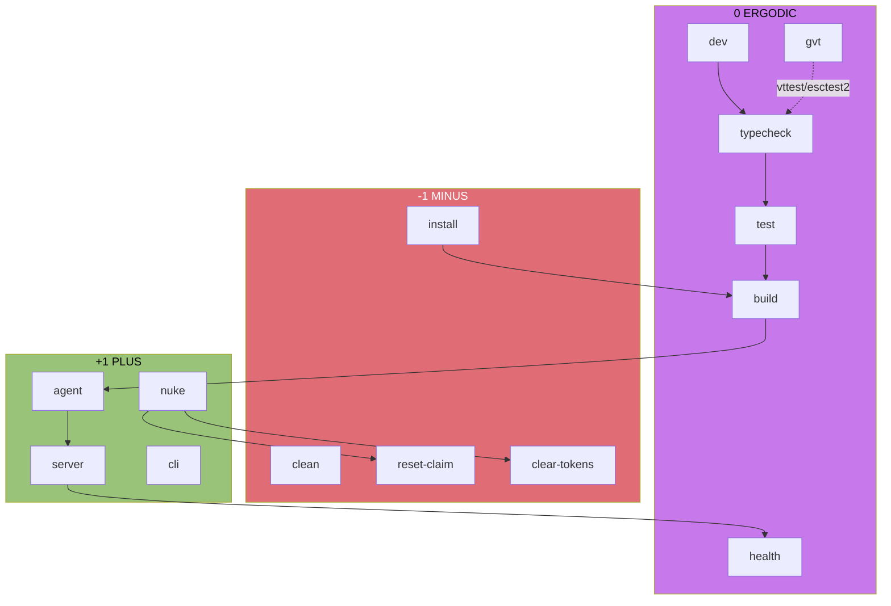
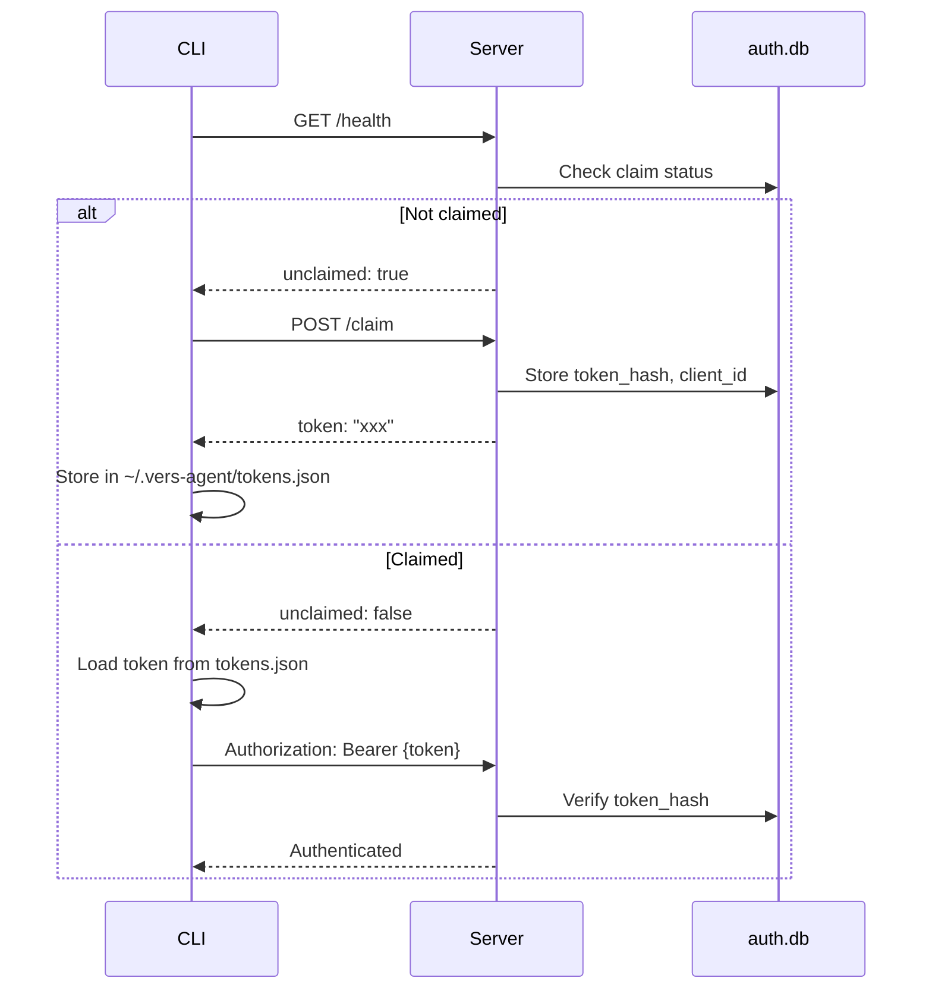

# vers-agent Momentum | #c778ea

> Maximally lossless capture of conceptual underpinnings at any scale.

## Seed Crystal

```
vers-agent = Claude harness × dual-interface × VM-native
libghostty-vt = terminal parser × zero-deps × embeddable
GF(3) = {-1, 0, +1} conservation across all recipe flows
```

## The Trifold Structure

### Layer 0: Atomic Trits

| Trit | Semantic | Energy | justfile | libghostty |
|------|----------|--------|----------|------------|
| -1 | MINUS | Setup/Teardown | `install`, `clean`, `reset-claim` | `asciinema-play` (recording) |
| 0 | ERGODIC | Process/Transform | `build`, `dev`, `typecheck`, `test` | `libghostty-vt` (parsing) |
| +1 | PLUS | Execute/Emit | `agent`, `server`, `nuke` | `vhs-server` (streaming) |

**Conservation Law:** Every workflow preserves `Σ trits ≡ 0 (mod 3)`

### Layer 1: Morphism Chains

```
Setup:     install(-1) → build(0) → agent(+1)     = 0 ✓
Dev:       dev(0) → typecheck(0) → test(0)        = 0 ✓  
Recovery:  nuke(+1) → {reset-claim(-1), clear-tokens(-1), kill-port(+1)} = 0 ✓
Terminal:  asciinema(-1) ⊗ libghostty(0) ⊗ vhs(+1) = 0 ✓
```

### Layer 2: Relational Diagram



## The Discovery Chain

### 1. libghostty-vt (Mitchell Hashimoto)

**What:** Zero-dependency terminal parser extracted from Ghostty.

**Why:** Replace ad-hoc VT parsing in tmux, VS Code, Vercel tooling.

**Key insight:** Terminal emulation is a **streaming parser** problem. libghostty-vt provides:
- CSI/OSC/DCS sequence parsing
- SGR (colors, styles) interpretation  
- Cursor/screen state machine
- Unicode grapheme clustering

### 2. Testing Ecosystem

| Tool | Purpose | Integration |
|------|---------|-------------|
| `vttest` | VT100/VT220 compliance | `just gvt` → option `[v]` |
| `esctest2` | Modern terminal sequences | `just gvt` → option `[e]` |
| `asciinema` | Session recording | `just gvt` → option `[r]` |
| Ghostty harness | Screenshot diffing | `test/run.sh` + Docker |

### 3. Ghostty Testing Pattern

```bash
# test/run.sh architecture:
for case in test/cases/*.sh; do
    xdotool type "$(cat $case)"    # Simulate input
    screenshot capture.png          # Capture terminal
    compare capture.png expected/   # Diff against golden
done
```

**Insight:** Visual regression testing for terminals via pixel comparison.

## The Claim Protocol



**Recovery:** `just nuke` = `kill-port` + `reset-claim` + `clear-tokens`

## The gvt Harness

Interactive TUI consolidating VT sequence testing:

```
╔══════════════════════════════════════════════════════════════╗
║  gvt - libghostty-vt interactive test harness                ║
║  #c778ea                                                     ║
╚══════════════════════════════════════════════════════════════╝

[1] SGR colors    [2] Cursor moves   [3] Screen modes
[4] OSC titles    [5] Mouse report   [6] Bracketed paste
[7] 256 colors    [8] True color     [9] Unicode/emoji
[v] vttest        [e] esctest        [r] record session
[q] quit
```

**Why one command:** Reduces cognitive load. All VT testing accessible from `just gvt`.

## Scale Invariance

This momentum document works at:

| Scale | Focus | Entry Point |
|-------|-------|-------------|
| **Macro** | Project architecture | "vers-agent = Claude harness × dual-interface" |
| **Meso** | Recipe workflows | GF(3) conservation diagrams |
| **Micro** | Individual commands | `just gvt`, `just nuke`, `just agent` |
| **Nano** | VT sequences | SGR, CSI, OSC parsers in libghostty |

## Continuation Vectors

1. **libghostty-vt integration** → Embed in vers-agent CLI for rich terminal rendering
2. **Screenshot diffing** → Port Ghostty's test harness for vers-agent output validation
3. **Session recording** → asciinema → asciicast → replay in gvt
4. **Claim federation** → Multi-server token management (like SSH agent forwarding)

## Incantation

```bash
# From zero to momentum:
git clone https://github.com/hdresearch/agent && cd agent
just bootstrap     # install + build
just gvt           # explore terminal capabilities
just agent         # run the Claude harness
```

---

*Thread: T-019b9c5a-78d5-73fb-b6cc-82831cc0cc89 → T-019b9c82-1b11-75ce-a735-c4155cf8748b*
*Color: #c778ea (ERGODIC 0)*
