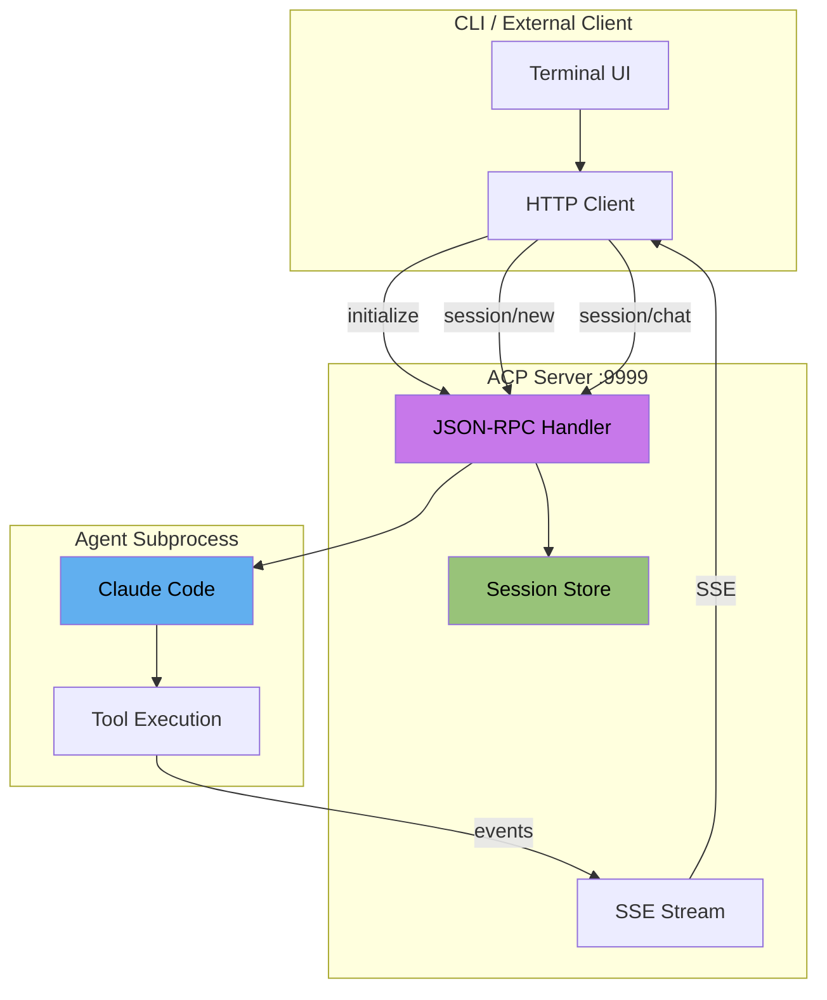

# vers-agent

[](https://github.com/hdresearch/agent/actions/workflows/ci.yml)

ACP-compliant agent harness with dual CLI/HTTP interface.

## Quick Start

```bash
git clone https://github.com/hdresearch/agent.git && cd agent
bun install && bun run build
export ANTHROPIC_API_KEY=sk-ant-...
./vers-agent
```

## What is ACP?

[Agent Client Protocol](https://agentclientprotocol.com/) is a JSON-RPC 2.0 based protocol for controlling AI agents.

**LLM-friendly docs:** [`docs/acp-llms.txt`](docs/acp-llms.txt) | [`docs/acp-llms-full.txt`](docs/acp-llms-full.txt)

vers-agent implements ACP to provide:

- **Session management** - Create, load, list, and persist sessions
- **Streaming notifications** - Real-time tool use, text deltas, and completion events
- **Capability negotiation** - Clients declare what they support (filesystem, terminal, MCP)
- **Multi-agent support** - Switch between different ACP-compatible agents

## Architecture



## Modes

| Command | Description |
|---------|-------------|
| `./vers-agent` | Server + CLI (default) |
| `./vers-agent --server` | HTTP server only |
| `./vers-agent --cli` | CLI only, connects to localhost:9999 |
| `./vers-agent --url http://host:9999` | CLI connecting to remote server |

## ACP Methods

| Method | Description |
|--------|-------------|
| `initialize` | Negotiate capabilities, get server info |
| `authenticate` | Token-based auth (first client claims server) |
| `session/new` | Create a new conversation session |
| `session/load` | Resume an existing session |
| `session/list` | List all sessions |
| `session/chat` | Send a message, receive streaming response |
| `session/cancel` | Cancel an in-progress request |

## Development

```bash
just install      # Install dependencies
just dev          # Run with hot reload
just typecheck    # Type check
just test         # Run all tests
just build        # Compile to ./vers-agent
```

## Testing

### Unit Tests

```bash
just test-unit    # No server required
```

### Integration Tests

```bash
just server       # Terminal 1: start server
just test-integration  # Terminal 2: run tests
```

### VT Sequence Tests

Interactive terminal parsing tests using libghostty-vt patterns:

```bash
just test-interactive  # Full suite: spam + fuzz + visualization
just fuzz 1000         # Fuzz with 1000 iterations
just vt                # Interactive VT explorer
```

| Script | Purpose |
|--------|---------|
| `vt-spam.ts` | 118 VT sequences (SGR, CSI, OSC, ESC, DCS) |
| `vt-fuzz.ts` | Random/malformed sequence fuzzer |
| `vt-live-parse.ts` | Parser state machine visualization |
| `vt-mindblown.ts` | Visual demos (gradients, animations) |

## Project Structure

```
src/
├── protocol/         # ACP type definitions
│   ├── acp-types.ts  # Session, capabilities, methods
│   └── jsonrpc.ts    # JSON-RPC 2.0 message types
├── server/           # ACP HTTP server (Bun.serve)
├── client/           # HTTP client for ACP
├── cli/              # Terminal UI (Ink/React)
├── core/             # Agent orchestration
└── utils/            # Config, session store (SQLite)
```

## Environment

| Variable | Required | Default |
|----------|----------|---------|
| `ANTHROPIC_API_KEY` | Yes | - |
| `PORT` | No | 9999 |

## Auth Model

First client to connect claims the server and receives a token. Subsequent clients must provide this token. Tokens persist in `~/.vers-agent/tokens.json`.

```bash
just show-tokens   # View stored tokens
just reset-claim   # Reset server claim
just nuke          # Full reset (tokens + claim + kill port)
```

## License

MIT
